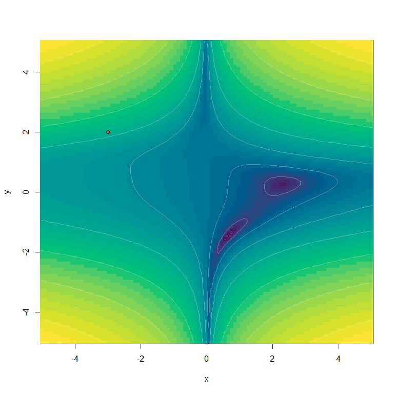
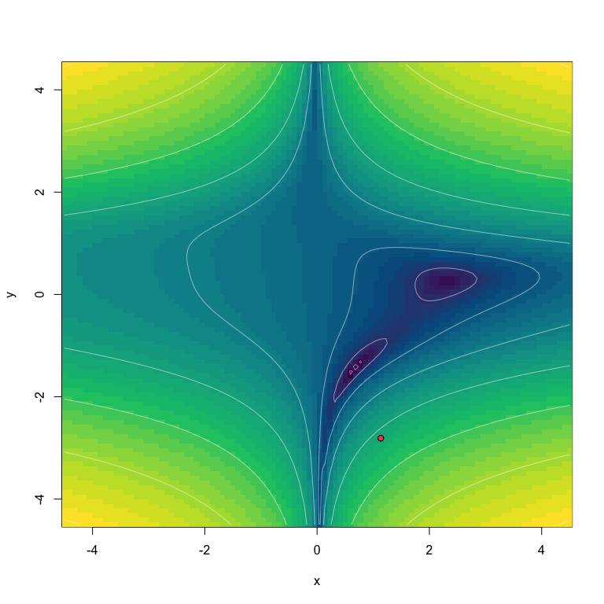
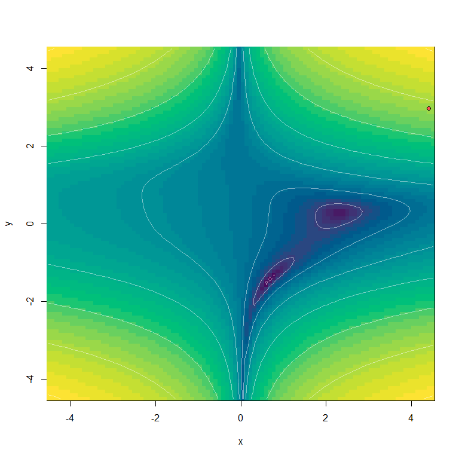

<!-- README.md is generated from README.Rmd. Please edit that file -->

# torchopt

<!-- badges: start -->

[](https://github.com/e-sensing/torchopt/actions)
[](https://cran.r-project.org/package=torchopt)
[](https://lifecycle.r-lib.org/articles/stages.html)
[](https://www.apache.org/licenses/LICENSE-2.0)

<!-- badges: end -->

The `torchopt` package provides R implementation of deep learning
optimizers proposed in the literature. It is intended to support the use
of the torch package in R.

## Installation

Installing the CRAN (stable) version of `torchopt`:

``` r
install.packages("torchopt")
```

Installing the development version of `torchopt` do as :

``` r
library(devtools)
install_github("e-sensing/torchopt")
```

    #> Warning: package 'torch' was built under R version 4.1.3

## Provided optimizers

`torchopt` package provides the following R implementations of torch
optimizers:

-   `optim_adamw()`: AdamW optimizer proposed by Loshchilov & Hutter
    (2019). Converted from the `pytorch` code developed by Collin
    Donahue-Oponski available at
    <https://gist.github.com/colllin/0b146b154c4351f9a40f741a28bff1e3>

-   `optim_adabelief()`: Adabelief optimizer proposed by Zhuang et al
    (2020). Converted from the authors’ PyTorch code:
    <https://github.com/juntang-zhuang/Adabelief-Optimizer>.

-   `optim_adabound()`: Adabound optimizer proposed by Luo et al.(2019).
    Converted from the authors’ PyTorch code:
    <https://github.com/Luolc/AdaBound>.

-   `optim_adahessian()`: Adahessian optimizer proposed by Yao et
    al.(2021). Converted from the authors’ PyTorch code:
    <https://github.com/amirgholami>.

-   `optim_madgrad()`: Momentumized, Adaptive, Dual Averaged Gradient
    Method for Stochastic Optimization (MADGRAD) optimizer proposed by
    Defazio & Jelassi (2021). The function is imported from
    [madgrad](https://CRAN.R-project.org/package=madgrad) package and
    the source code is available at <https://github.com/mlverse/madgrad>

-   `optim_nadam()`: Incorporation of Nesterov Momentum into Adam
    proposed by Dozat (2016). Converted from the PyTorch site
    <https://github.com/pytorch/pytorch>.

-   `optim_qhadam()`: Quasi-hyperbolic version of Adam proposed by Ma
    and Yarats(2019). Converted from the code developed by Meta AI:
    <https://github.com/facebookresearch/qhoptim>.

-   `optim_radam()`: Rectified verison of Adam proposed by Liu et al.
    (2019). Converted from the PyTorch code
    <https://github.com/pytorch/pytorch>.

-   `optim_swats()`: Optimizer that switches from Adam to SGD proposed
    by Keskar and Socher(2018). Converted from the `pytorch` code
    developed by Patrik Purgai: <https://github.com/Mrpatekful/swats>

-   `optim_yogi()`: Yogi optimizer proposed by Zaheer et al.(2019).
    Converted from the `pytorch` code developed by Nikolay Novik:
    <https://github.com/jettify/pytorch-optimizer>

## Optimization test functions

You can also test optimizers using optimization [test
functions](https://en.wikipedia.org/wiki/Test_functions_for_optimization)
provided by `torchopt` including `"ackley"`, `"beale"`, `"booth"`,
`"bukin_n6"`, `"easom"`, `"goldstein_price"`, `"himmelblau"`,
`"levi_n13"`, `"matyas"`, `"rastrigin"`, `"rosenbrock"`, `"sphere"`.
Optimization functions are useful to evaluate characteristics of
optimization algorithms, such as convergence rate, precision,
robustness, and performance. These functions give an idea about the
different situations that optimization algorithms can face.

In what follows, we perform tests using `"beale"` test function. To
visualize an animated GIF, we set `plot_each_step=TRUE` and capture each
step frame using [gifski](https://CRAN.R-project.org/package=gifski)
package.

### `optim_adamw()`:

``` r
# test optim adamw
set.seed(12345)
torchopt::test_optim(
    optim = torchopt::optim_adamw,
    test_fn = "beale",
    opt_hparams = list(lr = 0.1),
    steps = 500,
    plot_each_step = TRUE
)
```


### `optim_adabelief()`:

``` r
set.seed(42)
test_optim(
    optim = optim_adabelief,
    opt_hparams = list(lr = 0.5),
    steps = 400,
    test_fn = "beale",
    plot_each_step = TRUE
)
```


### `optim_adabound()`:

``` r
# set manual seed
set.seed(22)
test_optim(
    optim = optim_adabound,
    opt_hparams = list(lr = 0.5),
    steps = 400,
    test_fn = "beale",
    plot_each_step = TRUE
)
```



### `optim_adahessian()`:

``` r
# set manual seed
set.seed(290356)
test_optim(
    optim = optim_adahessian,
    opt_hparams = list(lr = 0.2),
    steps = 500,
    test_fn = "beale",
    plot_each_step = TRUE
)
```



### `optim_madgrad()`:

``` r
set.seed(256)
test_optim(
    optim = optim_madgrad,
    opt_hparams = list(lr = 0.05),
    steps = 400,
    test_fn = "beale",
    plot_each_step = TRUE
)
```


### `optim_nadam()`:

``` r
set.seed(2903)
test_optim(
    optim = optim_nadam,
    opt_hparams = list(lr = 0.5, weight_decay = 0),
    steps = 500,
    test_fn = "beale",
    plot_each_step = TRUE
)
```


### `optim_qhadam()`:

``` r
set.seed(1024)
test_optim(
    optim = optim_qhadam,
    opt_hparams = list(lr = 0.1),
    steps = 500,
    test_fn = "beale",
    plot_each_step = TRUE
)
```


### `optim_radam()`:

``` r
set.seed(1024)
test_optim(
    optim = optim_radam,
    opt_hparams = list(lr = 1.0),
    steps = 500,
    test_fn = "beale",
    plot_each_step = TRUE
)
```


### `optim_swats()`:

``` r
set.seed(234)
test_optim(
    optim = optim_swats,
    opt_hparams = list(lr = 0.5),
    steps = 500,
    test_fn = "beale",
    plot_each_step = TRUE
)
```


### `optim_yogi()`:

``` r
# set manual seed
set.seed(66)
test_optim(
    optim = optim_yogi,
    opt_hparams = list(lr = 0.1),
    steps = 500,
    test_fn = "beale",
    plot_each_step = TRUE
)
```



## Acknowledgements

We are thankful to Collin Donahue-Oponski <https://github.com/colllin>,
Amir Gholami <https://github.com/amirgholami>, Liangchen Luo
<https://github.com/Luolc>, Liyuan Liu
<https://github.com/LiyuanLucasLiu>, Nikolay Novik
<https://github.com/jettify>, Patrik Purgai
<https://github.com/Mrpatekful> Juntang Zhuang
<https://github.com/juntang-zhuang> and the PyTorch team
<https://github.com/pytorch/pytorch> for providing pytorch code for the
optimizers implemented in this package. We also thank Daniel Falbel
<https://github.com/dfalbel> for providing support for the R version of
PyTorch.

## Code of Conduct

The torchopt project is released with a [Contributor Code of
Conduct](https://contributor-covenant.org/version/2/0/CODE_OF_CONDUCT.html).
By contributing to this project, you agree to abide by its terms.

## References

-   ADABELIEF: Juntang Zhuang, Tommy Tang, Yifan Ding, Sekhar Tatikonda,
    Nicha Dvornek, Xenophon Papademetris, James S. Duncan. “Adabelief
    Optimizer: Adapting Stepsizes by the Belief in Observed Gradients”,
    34th Conference on Neural Information Processing Systems (NeurIPS
    2020), <https://arxiv.org/abs/2010.07468>.

-   ADABOUND: Liangchen Luo, Yuanhao Xiong, Yan Liu, Xu Sun, “Adaptive
    Gradient Methods with Dynamic Bound of Learning Rate”, International
    Conference on Learning Representations (ICLR), 2019.
    <https://doi.org/10.48550/arXiv.1902.09843>.

-   ADAHESSIAN: Zhewei Yao, Amir Gholami, Sheng Shen, Mustafa Mustafa,
    Kurt Keutzer, Michael W. Mahoney. “Adahessian: An Adaptive Second
    Order Optimizer for Machine Learning”, AAAI Conference on Artificial
    Intelligence, 35(12), 10665-10673, 2021.
    <https://arxiv.org/abs/2006.00719>.

-   ADAMW: Ilya Loshchilov, Frank Hutter, “Decoupled Weight Decay
    Regularization”, International Conference on Learning
    Representations (ICLR) 2019.
    <https://doi.org/10.48550/arXiv.1711.05101>.

-   MADGRAD: Aaron Defazio, Samy Jelassi, “Adaptivity without
    Compromise: A Momentumized, Adaptive, Dual Averaged Gradient Method
    for Stochastic Optimization”, arXiv preprint arXiv:2101.11075, 2021.
    <https://doi.org/10.48550/arXiv.2101.11075>

-   NADAM: Timothy Dazat, “Incorporating Nesterov Momentum into Adam”,
    International Conference on Learning Representations (ICLR), 2019.
    <https://openreview.net/pdf/OM0jvwB8jIp57ZJjtNEZ.pdf>

-   QHADAM: Jerry Ma, Denis Yarats, “Quasi-hyperbolic momentum and Adam
    for deep learning”. <https://arxiv.org/abs/1810.06801>

-   RADAM: Liyuan Liu, Haoming Jiang, Pengcheng He, Weizhu Chen,
    Xiaodong Liu, Jianfeng Gao, Jiawei Han, “On the Variance of the
    Adaptive Learning Rate and Beyond”, International Conference on
    Learning Representations (ICLR) 2020.
    <https://arxiv.org/abs/1908.03265>.

-   SWATS: Nitish Keskar, Richard Socher, “Improving Generalization
    Performance by Switching from Adam to SGD”. International Conference
    on Learning Representations (ICLR), 2018.
    <https://arxiv.org/abs/1712.07628>.

-   YOGI: Manzil Zaheer, Sashank Reddi, Devendra Sachan, Satyen Kale,
    Sanjiv Kumar, “Adaptive Methods for Nonconvex Optimization”,
    Advances in Neural Information Processing Systems 31 (NeurIPS 2018).
    <https://papers.nips.cc/paper/8186-adaptive-methods-for-nonconvex-optimization>
